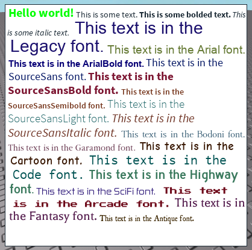

# rbx-rtf-label


A rich text label built using [Roact](github.com/Roblox/Roact). Super super early in development.

## Installation

1. Grab Roact from somewhere. For quick tests, put it in ReplicatedStorage - that's where the default code expects it to be. If you want to change it, check the top of the module, where it loads Roact.
2. Grab the module's source from the repository (check the `src` folder); put it in ReplicatedStorage or somewhere you can get to.
3. You're done!

## Usage
**Note: this project is in a very very early state. It may change dramatically and with no warning - do not use this for anything important yet.**

The code that generated the demo image above:

```lua
local Roact = require(game.ReplicatedStorage.Roact)
local RTFLabel = require(game.ReplicatedStorage.RTFLabel.RTFLabel)

local nodes = {
	{
		Text = "Hello world!";
		TextSize = 24;
		Font = Enum.Font.SourceSansBold;
		TextColor = Color3.fromRGB(0, 255, 0);
	},
	{
		Text = "This is some text.";
		TextSize = 16;
		Font = Enum.Font.SourceSans;
		TextColor3 = Color3.new(0, 0, 0)
	},
	{
		Text = "This is some bolded text.";
		TextSize = 16;
		Font = Enum.Font.SourceSansBold;
		TextColor3 = Color3.new(0, 0, 0);
	},
	{
		Text = "This is some italic text.";
		TextSize = 16;
		Font = Enum.Font.SourceSansItalic;
		TextColor3 = Color3.new(0, 0, 0);
	},
}

for _, font in ipairs(Enum.Font:GetEnumItems()) do
	table.insert(nodes, {
		Text = "This text is in the "..font.Name.." font.",
		TextSize = math.random(16, 24);
		Font = font;
		TextColor = Color3.new(math.random() / 2, math.random() / 2, math.random() / 2);
	})
end

local gui = Roact.createElement("ScreenGui", {}, {
	Container = Roact.createElement("Frame", {
		AnchorPoint = Vector2.new(0.5, 0.5),
		BackgroundColor3 = Color3.new(1, 1, 1),
		Size = UDim2.new(0, 400, 0, 400),
		Position = UDim2.new(0.5, 0, 0.5, 0),
	}, {
		RTFDemo = Roact.createElement(RTFLabel, {
			Size = Vector2.new(400, 400),
			TextNodes = nodes,
		}),
	}),
})

Roact.reify(gui, game.Players.LocalPlayer:WaitForChild("PlayerGui"))

```